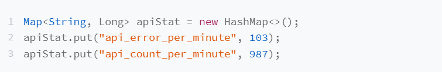

为了简化讲解和代码实现，我们假设自定义的告警规则只包含“||、&&、>、<、==”这五个运算符，其中，“>、<、==”运算符的优先级高于“||、&&”运算符，
“&&”运算符优先级高于“||”。在表达式中，任意元素之间需要通过空格来分隔。除此之外，用户可以自定义要监控的 key，比如前面的 api_error_per_minute\
api_count_per_minute

一般来讲，监控系统支持开发者自定义告警规则，比如我们可以用下面这样一个表达式，来表示一个告警规则，它表达的意思是：每分钟 API 总出错数超过 100
或者每分钟 API 总调用数超过 10000 就触发告警。
> api_error_per_minute > 100 || api_count_per_minute > 10000

在监控系统中，告警模块只负责根据统计数据和告警规则，判断是否触发告警。至于每分钟 API 接口出错数、每分钟接口调用数等统计数据的计算，是由其他模块来
负责的。其他模块将统计数据放到一个 Map 中（数据的格式如下所示），发送给告警模块。接下来，我们只关注告警模块。

